

  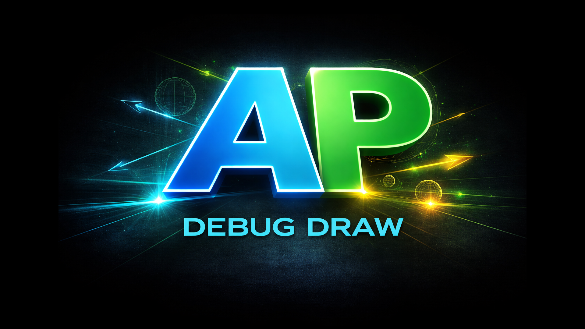 

# Async Physics Debug Draw

Calling Unreal Engine 5 debug draw helpers directly from the Async Physics Tick is not safe and may crash the engine, because debug rendering must happen on the Game Thread.

This plugin provides a clean and lightweight way to enqueue debug draw commands from the Physics Thread and render them later on the Game Thread. This keeps async simulation code simple, avoids `AsyncTask` workarounds, and removes the need for ad-hoc global buffers.

It also supports category-based filtering through a Data Asset, with runtime control through console commands during play.

The API is designed to be simple and consistent across both **Blueprint** and **C++**.

This plugin is available also on Fab: [link](https://www.fab.com/listings/c232d60e-9daf-49d0-8466-d86dab6e0d3a)

## Setup

### 1. Enable the plugin

Enable **Async Physics Debug Draw** from the Unreal Engine plugin list.

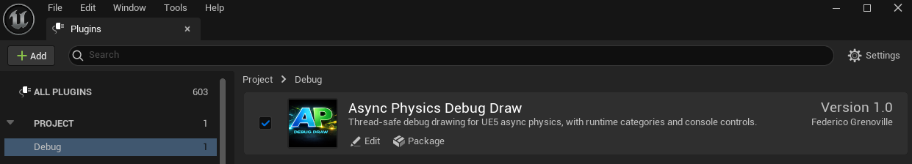

### 2. Create the category Data Asset

Create a Data Asset of type **AsyncPhysicsDebugDrawCategorySet** from:

**Miscellaneous → Data Asset**

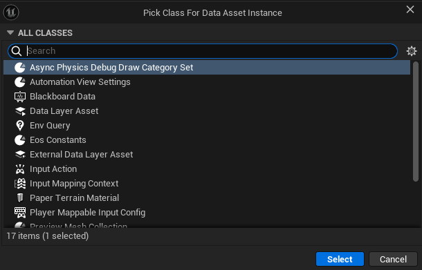

### 3. Configure the category set

Define the categories you want to use in your project.

Each category includes:

- **Name**  
  The category name used in code and in console commands to enable or disable rendering for that group of debug shapes.

- **Default Color**  
  The default color used for shapes in this category when no explicit color is provided in code.

- **Default Lifetime**  
  The default draw duration used for shapes in this category when no explicit lifetime is provided in code.

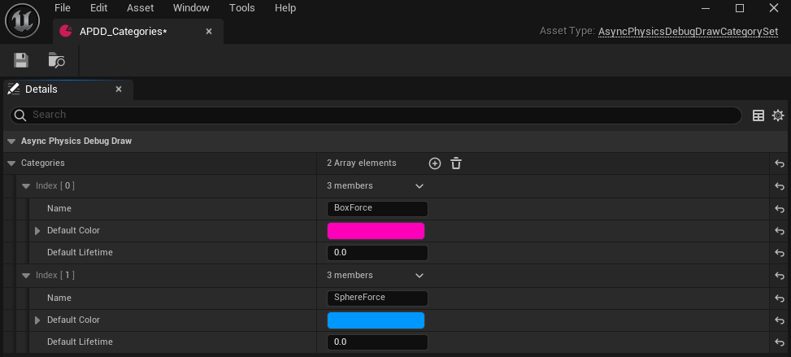

### 4. Assign the category set in Project Settings

Open **Project Settings**, then go to:

**Plugins → Async Physics Debug Draw**

Assign the category set created in the previous step.

The following settings define the startup behavior of the plugin:

- **Enable Draw**  
  Enables or disables debug rendering globally.

- **Duration Multiplier**  
  A global multiplier applied to draw lifetime. This is useful when you want to make all debug shapes stay longer or disappear faster without changing code or editing category defaults.

- **Draw Categories**  
  Defines which categories should be rendered.  
  Use `All` to enable every category.  
  If nothing is specified, no categories are drawn.

These settings can also be changed at runtime through console commands:

- `APDD.Enable`
- `APDD.DurationScale`
- `APDD.Cats`

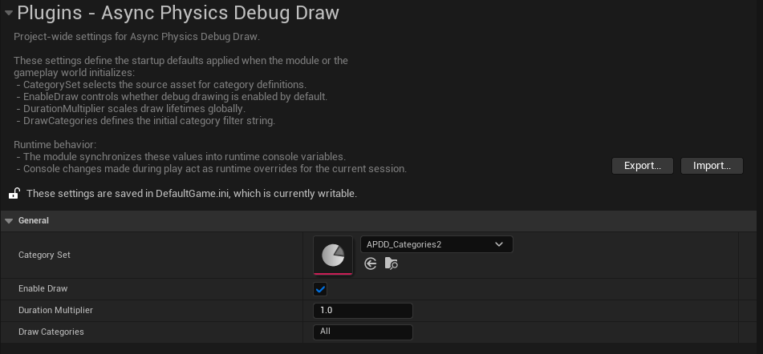

## Usage

### 1. Create a category handle variable

Create a variable of type:

`AsyncPhysicsDebugDrawCategoryHandle`

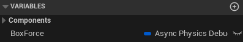

### 2. Resolve the category handle in BeginPlay

In `BeginPlay`, call `FindCategoryHandle` using the category name you want to use, then cache the returned handle.

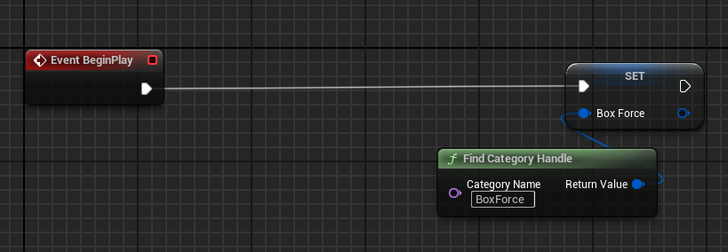
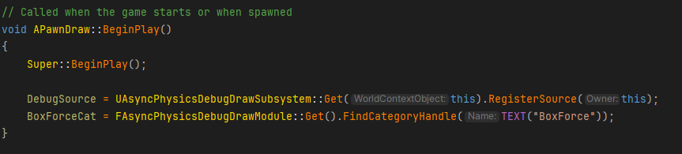

### 3. Unregister the owner in EndPlay

In `EndPlay`, unregister the owner from the global system by calling:

- `UnregisterOwner` in Blueprint
- `UnregisterSource` in C++

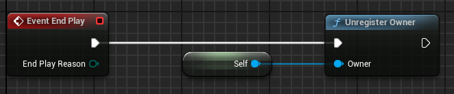
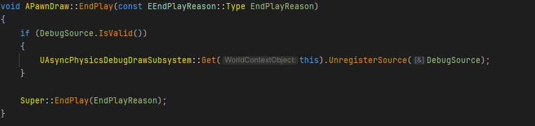

### 4. Draw from Async Physics Tick

Inside the Async Physics Tick, call one of the available draw functions:

- `Add Line`
- `Add Sphere`
- `Add Arrow`

Pass the geometry parameters together with the category handle resolved earlier.

If needed, you can use the **Explicit** versions of these functions to override the default color and duration defined by the category.

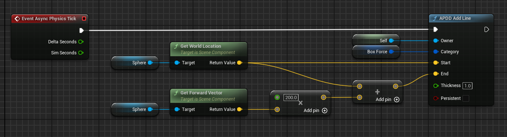
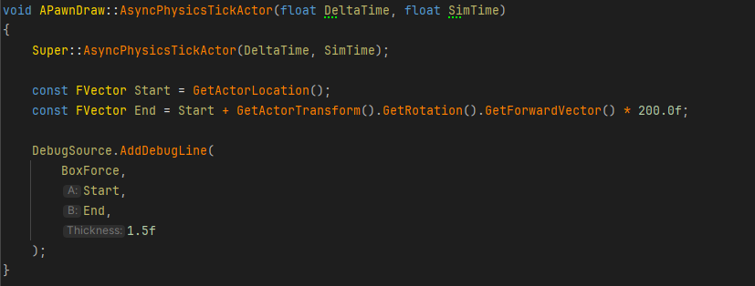

## Closing Notes

Async Physics Debug Draw was built to make debugging async simulation in Unreal Engine simpler and safer.

If you are working with forces, traces, motion vectors, contact points, or any other data produced inside the Async Physics Tick, this plugin gives you a straightforward way to visualize it without unsafe draw calls or custom thread-bridging code.

🫶 If you find it useful, feel free to use it, modify it and share feedback. 
And if you’d like to support the project, consider giving the repository a star.
